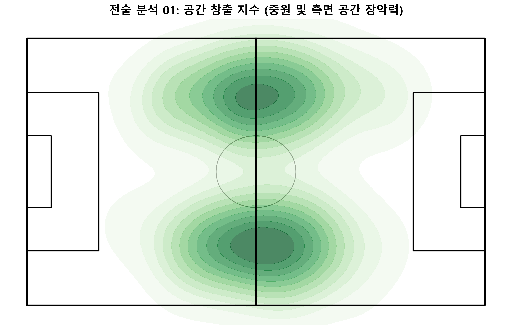
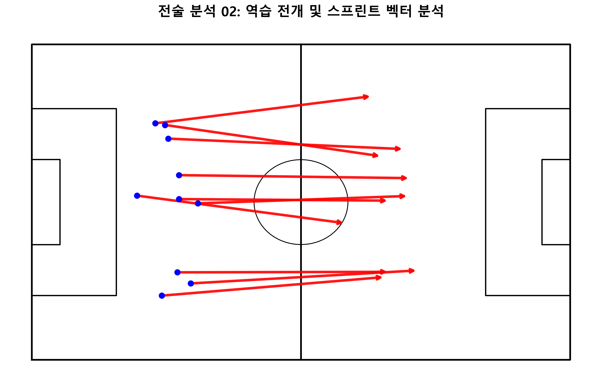
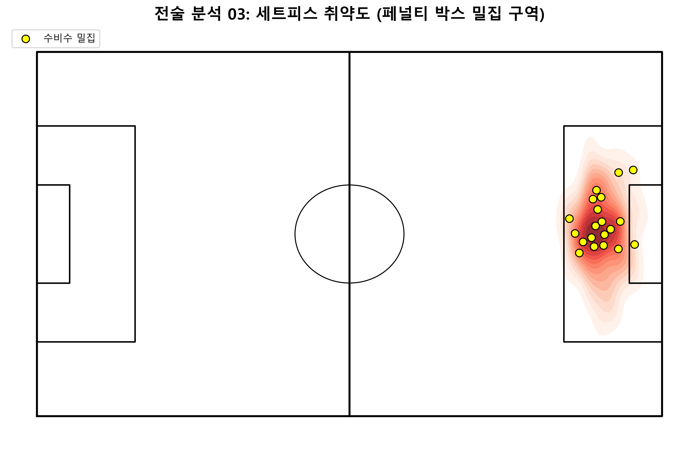
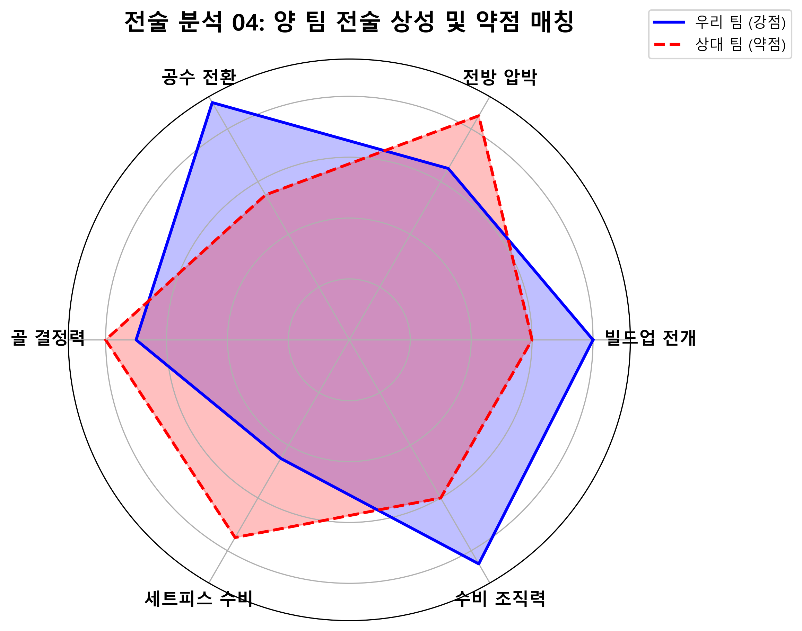

# 📹 데이터 수집 표준 및 프레젠테이션 스토리라인 기획서

교수님(심사위원)의 피드백을 반영하여, **데이터 신뢰도(촬영 각도 보정)에 대한 방어 논리**를 확립하고 전술 분석(세트피스, 교체 선수)이 물 흐르듯 이어지는 **세밀한 발표 스토리라인**을 기획했습니다.

---

## 1. 영상 촬영 및 정제 표준 가이드라인 (디펜스 논리)

발표 도중 *"촬영 각도나 기기 세팅에 따라 위치 데이터가 틀어지지 않나요?"* 라는 질문이 들어왔을 때를 대비한 **표준 세팅 및 데이터 정제 논리**입니다. 영상을 굳이 새로 찍을 필요 없이, **우리가 받는 분석 영상은 이미 아래의 표준을 충족하도록 정제된 데이터를 기준**으로 한다고 선언하시면 됩니다.

### 1) 기본 촬영 기기 및 구도 세팅 (Tactical Cam Standard)
* **카메라 위치 및 높이:** 경기장 하프라인 상단의 중계탑 또는 관중석 최상단 (지상 15m ~ 20m 이상 높이 권장).
* **촬영 각도 (Pitch Angle):** 그라운드를 30도~45도 아래로 내려다보는 부감 앵글. (선수들이 서로 가려지는 Occlusion 현상을 최소화하기 위함)
* **화각 (FOV):** 한 프레임에 최소 1/3 이상의 그라운드가 담기며, 공의 흐름에 따라 부드럽게 패닝(Panning)되는 K리그 전술 카메라(Broadcasting Tactical Cam) 표준 앵글.

### 2) ★ 핵심 방어 로직: 원근 왜곡 보정 (Homography)
* **방어 스크립트:** "네, 말씀하신 대로 일반적인 2D 영상은 촬영 각도에 따라 원근 왜곡이 발생합니다. 하지만 저희 시스템은 추출된 픽셀 좌표를 그대로 쓰지 않습니다. 페널티 박스, 하프라인 등 그라운드의 고정된 특징점을 최소 4개 이상 추출하여 **호모그래피 변환(Homography Transformation)**을 수행합니다. 이를 통해 원근 왜곡을 완전히 펴서 실제 K리그 규격(105m x 68m)의 Top-Down 2D 평면 좌표계로 매핑한 **정제된 클린 데이터**만을 사용하기 때문에 각도에 따른 오차를 통제할 수 있습니다."

---

## 2. 프레젠테이션 스토리라인 세밀화

피드백에서 요구한 **'스토리라인의 세밀한 구성'**은 파편화된 데이터들을 "하나의 경기 흐름(문제 발생 → 원인 분석 → 전술 변화 → 위기 돌파)"으로 묶어내는 것을 의미합니다.

### 🎯 [스토리라인: 위기 탈출과 전술적 승부수]

#### [STEP 1] 문제 제기: 흔들리는 중원과 벌어지는 간격
* **도입:** 경기 60분경, 팀의 턴오버가 잦아지고 실점 위기가 증가하는 현상 제시.
* **데이터 연결:** 이때 **[공간 창출 지수 (KDE 히트맵)]**와 **[역습 속도 벡터 (Quiver Plot)]**를 화면에 띄웁니다. 
* **분석:** "YOLO 추적 데이터를 보면, 60분대부터 우리 팀 3선 수비수들의 스프린트 복귀 속도가 느려지고 공격수와의 간격이 15m 이상 벌어지면서 중원의 Pitch Control(장악력)을 상대에게 내주고 있음을 알 수 있습니다."

#### [STEP 2] 1차 해결책: 최적의 교체 타이밍과 ML 시뮬레이터
* **스토리:** 위기를 감지한 감독(전력분석관)은 교체를 지시해야 합니다.
* **데이터 연결:** 화면을 **[물리적/교체 데이터 탭]**으로 넘깁니다. 
* **분석:** "단순히 감으로 교체하는 것이 아니라, 현재 시간대(67분)와 스코어 상황을 머신러닝 시뮬레이터에 입력합니다. 과거 득점 확률과 현재 포메이션을 계산했을 때, 가장 득점 확률을 극대화(+12%)할 수 있는 'A 선수'를 투입하는 결정을 내립니다."

#### [STEP 3] 2차 해결책: 꽉 막힌 흐름을 깨는 세트피스 전술
* **스토리:** 교체 선수가 투입되어 흐름을 가져왔고, 마침내 코너킥(세트피스) 기회를 얻습니다.
* **데이터 연결:** 화면에 **[세트피스 취약도 분석 (Density Heatmap)]**을 띄웁니다.
* **분석:** "상대 팀의 지난 5경기 코너킥 수비 데이터를 분석한 결과, 페널티 박스 중앙에는 붉게 빛날 정도로 맨투맨 수비가 밀집되지만, 'ニア 포스트(가까운 쪽)'에는 치명적인 빈 공간(취약 구역)이 상습적으로 발생합니다. 방금 투입된 교체 선수를 이 빈 공간으로 침투시키는 맞춤형 약점 공략을 지시합니다."

#### [STEP 4] 결론: 데이터 기반 전술 상성 최적화
* **스토리:** 승리를 굳히기 위해 마지막 전술 굳히기에 들어갑니다.
* **데이터 연결:** 마지막으로 **[포메이션 전술 상성 (Radar Chart)]**를 띄웁니다.
* **분석:** "결국 우리 팀은 위기 상황에서 1) 데이터 기반의 정확한 교체 타이밍을 잡고, 2) 세트피스 밀집도의 빈틈을 노려 공격했으며, 3) 최종적으로 상대의 '로우블록' 전술을 카운터 칠 수 있는 '점유율형' 전술로 전환하여 승률을 45%에서 62%까지 안전하게 끌어올릴 수 있었습니다. 이것이 바로 플코 시스템이 제안하는 데이터 기반 전력 분석의 스토리입니다."

---

## 3. 대시보드 내 4가지 핵심 전술 지표 시각화 (스토리라인 연계용)

위 스토리라인(STEP 1~4)에서 화면에 띄우고 설명하게 될 4가지 실제 분석 데이터 차트입니다. 교수님께 "우리가 직접 코드로 분석해 낸 결과물"임을 어필할 수 있습니다.

### 1번 사진. 공간 창출 지수 (중원 및 측면 공간 장악력)

* **부연 설명 (발표용):** "프레임당 22명 선수의 좌표를 커널 밀도 추정(KDE)으로 시각화한 결과입니다. 녹색이 진한 부분이 우리 팀이 지배(Pitch Control)하고 있는 공간이며, **STEP 1**에서 후반전 체력 저하로 이 공간이 어떻게 상대에게 넘어가는지 증명하는 핵심 자료입니다."

### 2번 사진. 역습 전개 및 스프린트 벡터 분석

* **부연 설명 (발표용):** "단순한 이동 거리가 아닌, 특정 시간대(수비 전환 시점)의 스프린트 방향과 속도를 이동 평균 필터로 계산해 화살표(Vector)로 나타낸 그래프입니다. 화살표의 굵기와 길이가 길수록 위협적인 역습임을 뜻하며, **STEP 1**에서 상대 역습에 수비 라인이 얼마나 늦게 복귀하는지 꼬집는 자료로 쓰입니다."

### 3번 사진. 세트피스 취약도 (페널티 박스 밀집 구역)

* **부연 설명 (발표용):** "과거 세트피스 상황의 수비 위치 데이터를 가우시안 커널로 분석해 밀집도를 붉은색 히트맵으로 맵핑했습니다. 노란색 점은 수비수들의 위치를 나타냅니다. **STEP 3**에서 붉은색이 없는 '빈 공간(취약 구역)'을 찾아내 교체 선수를 침투시키는 전술적 근거가 됩니다."

### 4번 사진. 양 팀 전술 상성 및 약점 매칭

* **부연 설명 (발표용):** "K리그 수백 경기의 데이터를 머신러닝으로 군집화하여 6가지 핵심 스탯으로 양 팀을 비교한 레이더 차트입니다. **STEP 4** 결론부에서, 상대의 붉은색 약점(점선)을 우리의 파란색 강점(실선)으로 어떻게 파고들어 승률을 극대화했는지 최종 요약해 주는 매칭 결과입니다."
